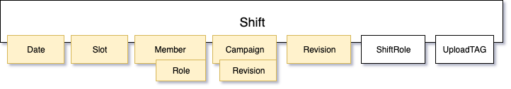

# Shifter - how to set up


Each shift that is saved in the system consists of mandatory (yellow) and optional (white) fields as shown in the Figure:

If ShiftRole is not assigned, a member-assigned role is displayed instead in the main overview.

## Import/export DB data

If you have one instance running with some data, you can dump it using:
```commandline
python manage.py dumpdata --natural-foreign --natural-primary -e contenttypes -e auth.Permission --indent 2 > dump.json
```
Load the data (command line)
```commandline
python manage.py migrate
python manage.py loaddata "path/to/dump.json"
```


## Set it up with docker
To build for the first time but also to run:
```commandline
docker-compose --env-file setup.env up
```

where `setup.env` contains fragile environmental variables.

You should now be able to visit the website:
http://localhost:8000

#### Import the DB data (PostgreDB within the docker container)
```commandline
cat path/to/dump.json | docker exec -i <<YourContainerID>> python manage.py loaddata --format=json -
```


## Set it up manually

Requirements:
- Django (>3.x)
- https://fullcalendar.io/docs

Create a new virtual environment:

```commandline
virtualenv ./venv/django_env
source ./venv/django_env/bin/activate
```

Install the requirements and iPython to have a nice shell:

```commandline
pip install -r requirements.txt
pip install ipython
```

Setup the development environment variables:

```sh
export DJANGO_SECRET_KEY='8(m)79e5&@(8we&i$2o(dqg7th4!$3(iivzustzr*$jvwc5ij^'
export DJANGO_DEBUG=1
export DJANGO_LOCAL_DEV=1
```
*Note, this is not the production secret key ;-)*

Initialise the database:

```commandline
python manage.py migrate
```
And import the basic setup ()
```commandline
python manage.py shell << 0001_create_basics.py
```

Start the development server:

```commandline
python manage.py runserver
```

You should now be able to visit the website:
http://127.0.0.1:8000
