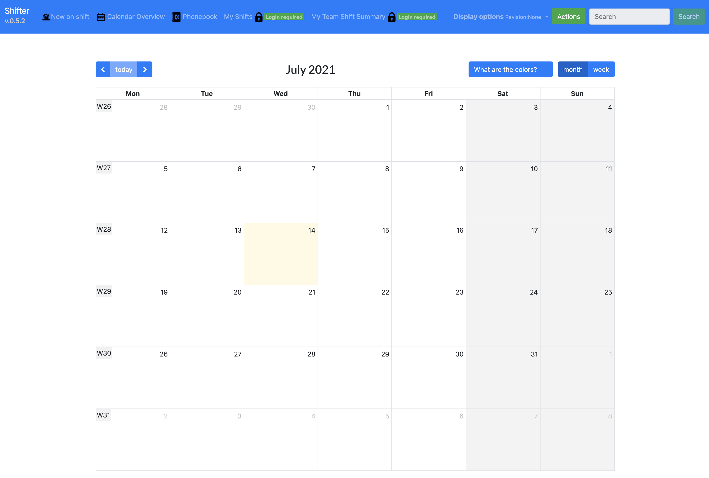

# Shifter
A simple system for displaying (Web server) and for managing/scheduling shifts, including:
- members, roles, teams,
- campaigns, time slots, 
- assigned shifts
- provides simple way of booking additional members slots (eg. studies, visits)

Main view with the calendar



## Additional bookings
## Planning
tbc

### Members view
tbc

### Import shifts from the CSV file

If one provides a csv file (example below) 
that has start date in the file name, ie. ```some_name_ASOF__YYYY-MM-DD.csv ```
all shifts will be imported automatically.

```buildoutcfg
# name, day1, day2, day3, day4, day5, day6, day7 ....
name1, NWH, NWH, , , , , ,
name2, , , NWH, NWH,
```

> **Shift roles assignment:**
> - there may be a default shift-role assignment per import,
> - if the default is not assigned, the member roles will be used,
> - if the default should not be used ```@@``` tag should be used, e.g. ```AM:@@```, it will make use of member assigned role,
> - if different shift role should be used, mark it explicitly ```AM:TS2S```.
> 
>**Note**:
> - spaces between the comas are removed
> - if the shift is not found, the import default one is assigned.

>**IMPORTANT**:
>names and shift-day-slots need to be defined in the system.  
> In case name/slot is not found, given name-day-slot is skipped!


#### Available slots and roles
The initial import (see the later part of the installation part) provides the following shift slots:
```buildoutcfg
AM - morning
PM - afternoon
NWH - normal working hours
```
and member roles:
```buildoutcfg
SL - Shift Leader
OP - Operator
SE - System Expert
STL - Study Leader
LM - Line Manager
```